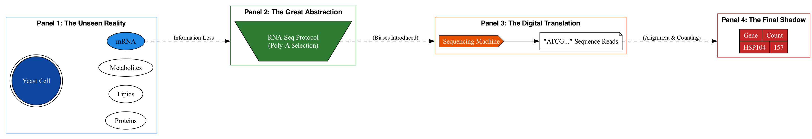
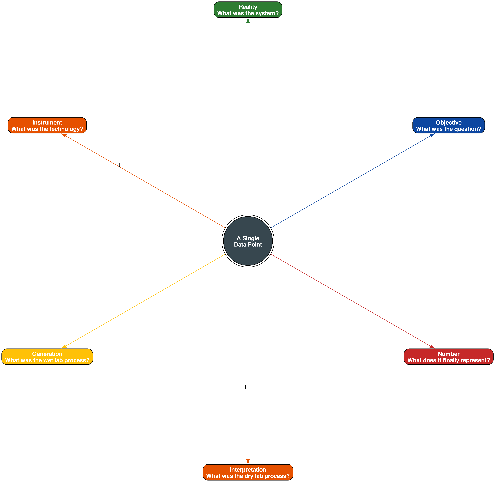

Biological data is often introduced as numbers, sequences, matrices, or networks. This framing is convenient—but incomplete.

Biological data is not merely recorded information. It is the trace of a living process, captured under constraints, approximations, and experimental interference. Every dataset is shaped by:
	•	evolutionary history
	•	experimental design
	•	measurement error
	•	environmental context

To analyze biological data effectively, one must first abandon the assumption that it behaves like data from engineered systems.

Biological data is evidence, not truth.

# Chapter 1: How to Think About Biological Data

### The Allure of the Number

There is a moment in the career of every data-focused scientist that is both thrilling and perilous. It is the moment you receive your first large-scale dataset. It arrives as a file, perhaps named `counts.tsv` or `variants.vcf`, a grid of numbers and letters holding the promise of discovery. The temptation is immense: to dive in, to execute the first line of code, to run the statistical test, to find the pattern, to publish the result. The numbers feel objective, clean, and true. They feel like an answer.

This book is about learning to resist that temptation. It is about learning to pause. It is about cultivating the discipline to look at that file not as an answer, but as a question. The goal of this first chapter—and this entire first section—is to build the mental framework required to interrogate our data before we begin to analyze it. It is about learning to think like a biological data scientist, which means thinking about the biology *behind* the data first.

Our primary tool in this endeavor will not be a programming language or a statistical model, but a simple, ancient story.

### The Parable of the Biological Cave

The Greek philosopher Plato, in his work *Republic*, tells a story known as the Allegory of the Cave. He asks us to imagine a group of people who have lived their entire lives chained inside a cave, facing a blank wall. They can only see the shadows of objects that are passed between a fire and their backs. For these prisoners, the shadows are not representations of reality; they *are* reality. When a shadow of a bird is cast on the wall, they call it "bird." They become experts in the behavior of shadows, yet they know nothing of the world outside.

As a bioinformatician, you are, in many ways, one of these prisoners. The lab, the sequencer, and the computer are our cave. The raw, dynamic, and infinitely complex processes of life are the objects we wish to study. But we cannot see them directly. Instead, we see their shadows, cast on the wall of our computer screens. These shadows are our data.

A count of `157` in a gene expression file is not a gene; it is the shadow of a collection of RNA molecules that were once in a cell. A three-dimensional PDB structure is not a protein; it is the shadow of a molecule that, in reality, is a vibrating, fluctuating energetic landscape. A consensus genome sequence is not the DNA of an organism; it is the idealized shadow of a molecule that, in any given cell, is covered in epigenetic marks and coiled into complex shapes.

Our field has become exceptionally skilled at shadow-reading. We can classify them, measure their dimensions with astonishing precision, and build complex models to predict the behavior of one shadow based on another. But we must never forget that the real work is not to describe the shadow, but to infer the nature of the reality that cast it. The moment we mistake the data for the reality, we cease to be scientists and become mere shadow-gazers.

### The Anatomy of a Shadow: An RNA-Seq Journey

To truly appreciate the nature of these shadows, we must understand how they are cast. Let's trace the journey of a single data point from a common experiment: RNA sequencing (RNA-seq), designed to measure gene expression. We will give our experiment a name: "The Heat Shock Response Study."

**1. The Question and the System (The Unseen Reality):** Our journey begins not in the lab, but with a question: "How does a simple eukaryotic cell, like yeast, change its gene expression program when it gets hot?" This question provides the all-important *context*. Based on it, we design an experiment. We choose a specific strain of yeast (*Saccharomyces cerevisiae*), grow it in a defined liquid medium at a comfortable 30°C, and then shift a portion of the culture to a stressful 42°C for 15 minutes.

Right away, we have constrained reality. Our results will be specific to this strain, this medium, this time point. The yeast's response at 10 minutes, or in a solid medium, or in a different genetic background might be completely different. The reality we are studying is already a tiny, bounded subset of all possible realities.

**2. The Great Abstraction (Choosing a Shadow to Watch):** The cell is now stressed. Its proteins are beginning to misfold, its metabolism is shifting, and its membrane is changing fluidity. A universe of biology is happening. We, the experimenters, decide to perform an "RNA-seq" experiment. This is the great abstraction. We have chosen to ignore almost everything—the proteins, the metabolites, the lipids, the cell's morphology—to focus exclusively on one class of molecules: messenger RNA (mRNA). We have made the assumption that the abundance of mRNA is a reasonable proxy for the "gene expression program." This is a powerful and useful assumption, but an assumption nonetheless. We are now committed to seeing only the shadow cast by the transcriptome.

**3. The Violence of Measurement (Casting the Shadow):** Now we cast the shadow. The process is a series of physical and chemical steps, each of which distorts the information it is meant to preserve.
- **Lysis:** We add a chemical to the yeast culture that instantly bursts the cells open, spilling their contents. This single moment freezes a dynamic process in time, destroying all temporal and spatial information. We no longer know *where* in the cell an RNA molecule was, or what it was doing.
- **Extraction & Selection:** We use biochemical kits to purify the RNA from the cellular lysate. Most kits are designed to preferentially capture molecules with a poly-A tail, a feature of mature mRNA. In doing so, we discard a vast world of non-coding RNAs, which are themselves critical regulators of the cell.
- **Fragmentation & Conversion:** The delicate RNA molecules are then broken into smaller, more manageable fragments. This process is not perfectly random; some sequences are more likely to be cut than others. These fragments are then converted into more stable complementary DNA (cDNA). The enzymes that perform this conversion have their own biases, preferring certain templates over others.
- **The Digital Translation:** Finally, these cDNA fragments are fed into a sequencing machine. This marvel of engineering doesn't read the molecules directly. It detects sequential flashes of colored light, where each color corresponds to a nucleotide (A, C, G, or T). A camera captures these flashes, and software translates them into the digital strings of letters we recognize as sequence data. Errors can and do occur. The machine assigns a "quality score" to each letter—a measure of its confidence in that particular translation.

**4. The Final Polish (Interpreting the Shadow):** The raw data file contains millions of short sequences—the fragmented, digitized echoes of the original RNA population. To make sense of them, we perform bioinformatic processing. We align these reads to a reference genome, which is itself an abstraction—an idealized map of a genome that no single yeast cell possesses exactly. We then count how many reads map to the annotated location of each gene.

And at the end of this long, violent, and lossy journey, we get a number: `157`. For the heat shock gene *HSP104*, in sample "42°C, Replicate 1," we have a count of 157.

This number is our shadow. It is packed with meaning, but it is also the product of a dozen assumptions, biases, and abstractions. It is a powerful proxy for reality, but it is not reality itself.

### The First Habit: A Framework for Questioning

To avoid becoming a shadow-gazer, we must cultivate a habit of disciplined questioning. Before we even think about loading our data, we must interrogate its origin. The "First Question"—*What reality cast this shadow?*—can be broken down into a practical mental checklist. Let's call it the **ORIGIN** framework:

- **O - Objective:** What was the specific biological question that motivated the creation of this data? The answer provides the essential context for any discovery.
- **R - Reality:** What was the actual, physical biological system being studied? What organism, strain, cell line, and conditions were used?
- **I - Instrument:** What measurement technology was used (e.g., Illumina sequencing, mass spectrometry, confocal microscopy)? What are its known, systematic biases?
- **G - Generation:** What were the key steps in the "wet lab" protocol used to generate the sample? Where could information have been lost or distorted?
- **I - Interpretation:** What were the key steps in the "dry lab" bioinformatic pipeline used to process the raw data? What assumptions did the alignment, filtering, or normalization algorithms make?
- **N - Number:** Now, and only now, after considering all of the above: What does this specific number in this specific cell of my final data table actually represent?

Thinking through this framework forces us to reconnect the numbers to the biology. It is the intellectual scaffolding that prevents us from making unsupported leaps of logic. It is the difference between saying "The expression of HSP104 is 157" and saying "The measured abundance of RNA fragments mapping to the HSP104 locus, after this specific experimental and computational pipeline, was 157." The second statement is less dramatic, but infinitely more honest and scientifically sound.

### From Shadow-Gazer to Interpreter

This chapter is a call to intellectual arms. It is a request to slow down, to trade the thrill of instant analysis for the deeper satisfaction of true understanding. Thinking about biological data begins with a profound respect for the complexity of the living system we are trying to capture. It requires accepting that our data is an imperfect, biased, and abstracted representation of that system.

This is not a cause for despair. On the contrary, acknowledging the limitations of our data is the only way to use it responsibly and powerfully. By understanding how the shadows are cast, we can begin to make meaningful inferences about the reality that lies just beyond our sight. We can learn to distinguish artifacts from biology, and patterns from truth.

In the chapters that follow, we will delve deeper into the nature of these shadows—their noise, their biases, and the mathematical language we use to describe them. But this first habit of questioning the data's origin is the foundation upon which all else is built. It is the first and most crucial step in our journey to simplify bioinformatics, not by ignoring its complexity, but by understanding it fully.
