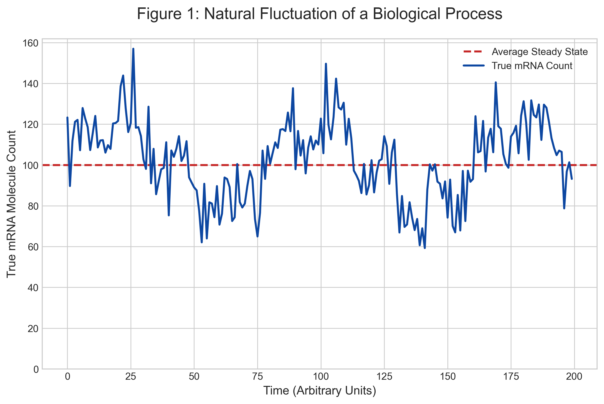
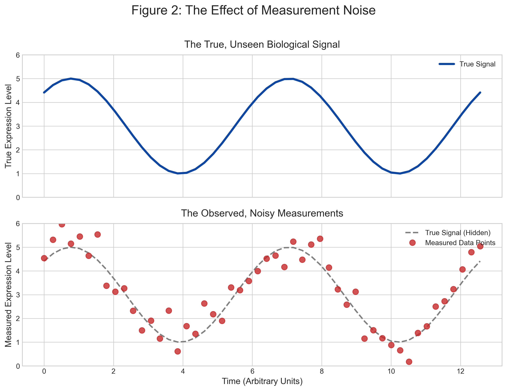
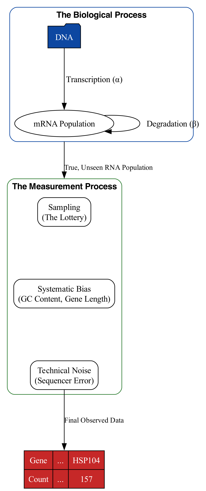

# Chapter 2: Generative Processes and Measurement

### From Shadow to Machine

In the last chapter, we established our foundational metaphor: biological data is a shadow of a living reality. We learned to question the origins of our data, to respect the long and lossy journey from a biological phenomenon to a number in a table. We have cultivated the discipline of seeing the shadow *as a shadow*.

Now, we must ask a more technical, more mechanistic question: *How is the shadow actually cast?* What is the machine that projects it? If we can understand the mechanics of that machine, we can begin to understand its quirks, its biases, and the specific ways it distorts the reality it is meant to represent. This "machine" is what data scientists call a **generative process**—a formal story, often told in the language of mathematics, that describes how the data came to be.

### The Recording Studio and the Live Performance

Before diving into biology, let's expand our analogy of the musical recording. Imagine you are in a room listening to a string quartet. The four musicians are a living, breathing system. The sound waves they produce are the "reality"—rich, continuous, and filling the space. This is the live performance.

A sound engineer wants to capture this performance. Their choices will fundamentally shape the resulting data (the recording):
-   **Microphone Choice (The Instrument):** A vintage tube microphone adds "warmth," while a modern condenser is "sharper." Neither is more "true," but they produce different representations. This is like the difference between sequencing platforms (e.g., Illumina's short, accurate reads vs. PacBio's long, noisier reads).
-   **Microphone Placement (The Experimental Design):** One microphone in the center captures the "blend" (like bulk RNA-seq). One microphone on each instrument captures individual "voices" (like single-cell RNA-seq).
-   **Analog-to-Digital Conversion (The Digitization):** The continuous sound wave is sampled thousands of times per second to create a digital signal. This is the fundamental act of converting a continuous reality into discrete data points, perfectly analogous to a sequencer converting flashes of light into the letters A, C, G, and T.
-   **Mixing and Mastering (The Bioinformatic Pipeline):** The engineer applies compression, equalization, and other effects to the raw recording to produce the final, polished track. This is analogous to a bioinformatician's normalization, filtering, and batch correction.

The final MP3 file is the data. It is a high-fidelity, useful representation, but it is not the performance. To a trained ear, the recording contains the echoes of every choice the engineer made. Our goal in this chapter is to become "data audiophiles"—to learn to "hear" the entire generative process in our data.

### The Ideal World: Modeling the Biological Process

Let's start with the biology itself. For gene expression, the "performance" is the dynamic life of mRNA molecules in a cell. We can model this with a simple "bathtub" analogy. The amount of water in the tub at any moment is the true abundance of a specific mRNA.
-   **The Faucet ($\alpha$):** Water flows into the tub at a certain rate. This is transcription, the process of creating new mRNA molecules.
-   **The Drain ($\beta$):** Water leaves the tub at a certain rate. This is degradation, the process of breaking down old mRNA molecules.

When the cell is in a stable condition, the inflow and outflow reach a balance, and the water level hovers around a certain point. This is called the **steady state**. However, this process is not perfectly smooth. The faucet may sputter and the drain may gurgle. In cellular terms, transcription happens in bursts, not a continuous stream. The result is that the true number of mRNA molecules naturally fluctuates over time, hovering around its steady-state average.

When a cell responds to a stimulus (like the heat shock from Chapter 1), it might crank open the faucet for the *HSP104* gene—dramatically increasing its transcription rate, $\alpha$. The water level rises to a new, higher steady state. This change in the underlying biological process is the **signal** we hope to detect.

### The Real World: The Layers of Measurement

Now, we enter the recording studio. We can't measure the water level directly; we have to take a sample. The measurement process layers its own characteristics on top of the biological fluctuations.

**Layer 1: The Sampling Lottery**
This is the most important concept for understanding count data. When we prepare a library for RNA-seq, we don't capture every molecule; we take a small sample. Imagine a giant barrel containing one million marbles of 20,000 different colors (the true RNA population in our cells). Our "sequencing depth" only allows us to draw 100,000 marbles at random.
-   **High-Abundance Colors:** If there are 50,000 red marbles (a highly-expressed gene), we are virtually guaranteed to draw thousands of them. Our sample will be a good representation.
-   **Low-Abundance Colors:** If there are only 10 blue marbles (a lowly-expressed gene), we might draw one, two, or, just by bad luck, zero. This is not because the blue marbles don't exist, but because our sample was too small to catch them. This "sampling noise" is the primary reason we see so many zeros and so much variance in single-cell and low-input RNA-seq data.

**Layer 2: The Bias Filter**
Our sampling net is not perfectly fair; it has holes of different sizes that preferentially catch certain fish. Our measurement tools have systematic biases that distort the representation of reality.
-   **Gene Length Bias:** In many protocols, longer genes produce more fragments than shorter genes at the same expression level, making them appear artificially more abundant.
-   **GC Content Bias:** The enzymes used for PCR amplification often work more efficiently on DNA fragments with a balanced GC content (around 40-60%). Genes with very high or very low GC content may be under-represented in the final data.
-   **Positional Bias:** The ends of genes (3' and 5' ends) are sometimes less likely to be captured, leading to uneven coverage across the gene body.

These are not random errors; they are systematic distortions. Part of our job is to know they exist and to correct for them.

### A Simulated View of Noise

The combined effect of biological fluctuation and the layers of measurement noise is that our final data is a distorted, "noisy" version of the true biological signal.

Imagine a gene whose true expression follows a perfect, clean sine wave over 24 hours (e.g., a circadian rhythm gene). This is the "ideal world" signal. Now, let's "measure" it. We take samples at different time points, but each measurement is subject to the sampling lottery and other technical noise. The resulting data points will not fall perfectly on the sine wave. They will be scattered around it.

This single image is one of the most important in all of bioinformatics. It clarifies our fundamental task: we are given the scattered points (the data) and must try to infer the shape of the hidden curve (the biology).

### The Composite Model

This brings us to our complete generative model, which formally combines the two parts.

`Data = Measurement(Biology) + Noise`

Our final dataset is a function of the true biological state, but it has been transformed by the systematic biases of our measurement process and further corrupted by random noise. This understanding is the key to all modern bioinformatics analysis.

-   **Normalization** (e.g., TPM, TMM) is the attempt to computationally reverse the systematic distortions from the *Measurement* function (e.g., correcting for gene length bias).
-   **Statistical Modeling** (e.g., for differential expression) is the attempt to distinguish a real change in the *Biology* from the random scatter introduced by *Noise*. It asks: "Is the difference between these two groups of scattered points large enough that we can confidently say the underlying curves are different?"

By building a mental model of this entire process, we can use our tools not as black boxes, but as instruments designed for a specific purpose: to see through the noise and glimpse the biological truth underneath.