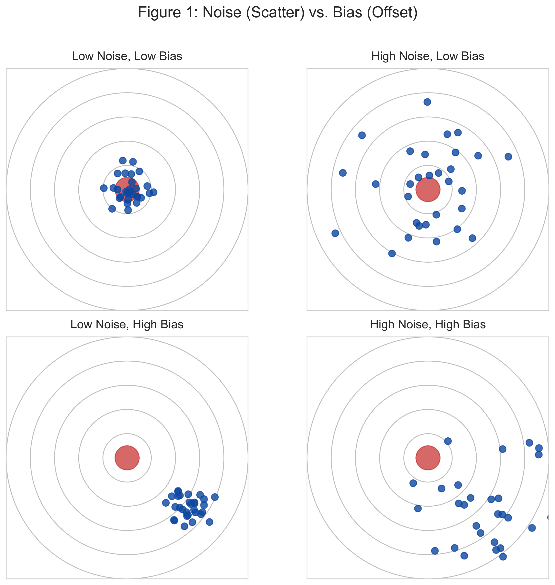
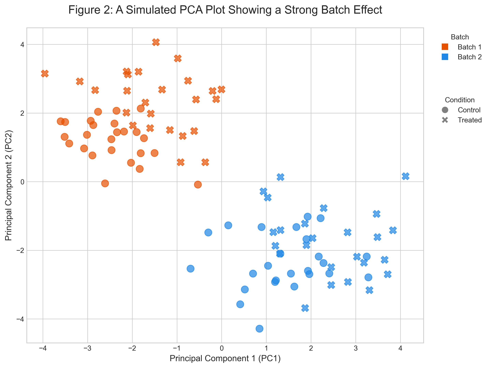

# Chapter 3: Noise, Bias, and Uncertainty

### The Inevitable Imperfections

In the last chapter, we dissected the generative process that produces our biological data. We understood that every data point is a product of both the underlying biological reality and the intricate, multi-layered process of its measurement. We saw that this journey from phenomenon to number introduces inherent deviations. Now, we will formalize these deviations, giving them names: **noise**, **bias**, and the scientific response to their inevitability: **uncertainty**.

Ignoring these imperfections is akin to navigating a dense fog and pretending the road is clear. A disciplined bioinformatician acknowledges the fog, characterizes its density, and uses tools to estimate the probability of reaching their destination safely.

### Part 1: Noise – The Random Hand of Chance

Imagine a dart player aiming for a bullseye. Even the most skilled player will not hit the exact center every single time. Their darts will cluster around the bullseye, but with some random scatter. This scatter is **noise**.

In biological data, noise refers to random, unpredictable fluctuations or errors that obscure the true signal. It's the inherent variability that doesn't follow a systematic pattern. We can categorize noise into two main types:

1.  **Biological Noise (Stochasticity):** This originates from the inherent randomness of biological processes. Transcription happens in bursts, not a continuous stream. Proteins are synthesized and degraded probabilistically. A cell doesn't "decide" to have exactly 102 copies of an mRNA molecule; it has a system that, on average, results in *around* 100 copies. This is the "sputtering faucet" of our bathtub analogy from Chapter 2. This noise reflects the fundamental stochasticity of life and is a true feature of the system, not an error.

2.  **Technical Noise (Measurement Error):** This comes from our experimental procedures. The most significant source is **sampling noise**—the "sampling lottery" where rare molecules can be missed by chance. Other sources include random chemical reactions during library prep or fleeting electrical fluctuations in the sequencer.

The key characteristic of noise is its randomness. It has no preferred direction. Across many repeated measurements, it tends to average out around the true value. Our statistical tools are primarily designed to model this random scatter and distinguish it from a genuine signal.

### Part 2: Bias – The Systematic Tilt

Now, imagine our dart player again. This time, their aiming sight is misaligned. Every dart, no matter how perfectly thrown, lands two inches to the left of the bullseye. This systematic, consistent deviation is **bias**.

Bias refers to systematic errors that consistently push measurements in a particular direction. Unlike noise, bias does not average out with more measurements; it persists and can lead to confidently wrong conclusions. Identifying and correcting for bias is one of the most critical tasks in bioinformatics.

### Part 3: A Rogues' Gallery of Common Biases

Bias is dangerous because it can be subtle and invisible. It can create patterns in the data that appear to be strong biological signals but are, in fact, methodological artifacts. Let's meet a few of the most wanted culprits.

**The Batch Effect:** This is perhaps the most infamous villain. A "batch" is any group of samples processed under similar conditions at the same time (e.g., on the same day, by the same person, with the same reagent kit, on the same lane of a sequencer). If you process your "control" samples on Monday and your "treated" samples on Tuesday, any observed difference might just be a "Monday vs. Tuesday" effect. Tiny, unnoticeable variations—a slight difference in room temperature, a new bottle of media, a technician's slightly different technique—can create systematic differences between the batches. When your experimental variable (control vs. treated) is perfectly confounded with your batch variable, the batch effect can create a completely spurious discovery or, just as bad, completely mask a real one.

**Survivor's Bias:** This occurs when we unconsciously filter our data for things that "survived" some selection process, and then treat that filtered set as representative of the whole. In gene expression analysis, this often happens when we discard all genes with low expression counts before performing a downstream analysis. We might then draw conclusions about the "average" behavior of genes, forgetting that we've thrown out a huge number of potentially important, low-expression genes. Our conclusions are not about *all* genes, but only about the "survivors" of our arbitrary filter.

**Reversion to the Mean:** This is a subtle statistical phenomenon that can trick us into seeing biological effects where none exist. In any measurement subject to noise, the most extreme values are likely to be less extreme upon a second measurement. For example, if you take the top 10 most highly-expressed genes from one replicate and look at their expression in a second replicate, they will, on average, have a lower rank. This is not necessarily due to a biological regulatory effect; it's a statistical inevitability. The "top 10" in the first sample were likely a combination of high true signal *and* random noise that pushed them even higher. In the second sample, the random noise is different and less likely to be so obligingly positive.

### Part 4: The B.U.N.K. Checklist – A Sanity Check for Results

To navigate this minefield of noise and bias, we need a mental framework. Before accepting any computational result, we must perform a sanity check. Let's call it the **B.U.N.K. Checklist**. When a colleague shows you a plot with an exciting pattern, or a table with a list of "significant" genes, mentally run through B.U.N.K.:

-   **B - Bias:** What systematic errors could create this pattern? Is it a batch effect? Is it a known technological bias of the platform? Could my filtering strategy have created this?
-   **U - Uncertainty:** How confident are we? Where are the error bars, the confidence intervals, the p-values? A pattern without a measure of uncertainty is just an anecdote.
-   **N - Noise:** How much random variation is expected in this system? Is the signal strong enough to rise above the noise floor, or could this pattern be due to chance alone?
-   **K - Kontext (Context):** Does this result make biological sense? Does it align with or contradict known biology? Is there a plausible mechanism, or is it a statistical curiosity?

This checklist forces us to be our own most rigorous skeptics. It's the practical application of the philosophies from the first two chapters.

### Part 5: Uncertainty – The Scientific Response

Given the omnipresence of noise and bias, it becomes clear that certainty is a luxury we rarely afford. Every measurement, every conclusion, every "discovery" comes with a degree of doubt. This doubt is not a weakness; it is a fundamental aspect of the scientific process, and we call it **uncertainty**.

The goal of a bioinformatician is not to eliminate uncertainty (which is impossible), but to **quantify it**. By understanding the sources and magnitudes of noise and bias, we can estimate how reliable our conclusions are. This is where statistics becomes our indispensable ally.

-   **P-values** are measures of "surprise" under a null hypothesis. They ask, "If there were truly no effect, how often would random noise produce a signal at least this strong?"
-   **Confidence Intervals** provide a range of plausible values for the "true" signal. A 95% confidence interval of [140, 174] for a gene's expression level doesn't mean there's a 95% chance the true value is in that range. It means that if we were to repeat the experiment 100 times, our calculated interval would contain the true value in 95 of those experiments. It's a statement about the reliability of our measurement procedure.

These are not just abstract concepts; they are our primary tools for communicating the robustness of our findings.

### Navigating the Fog

Embracing uncertainty is a sign of scientific maturity. It means understanding that our data is not a direct photograph of reality, but a processed, noisy, and potentially biased interpretation. Our task is to become expert interpreters, using our knowledge of generative processes, noise, and bias to make the most informed inferences possible. The B.U.N.K. checklist is our constant companion in this task, a simple reminder to question every result before we accept it as truth.