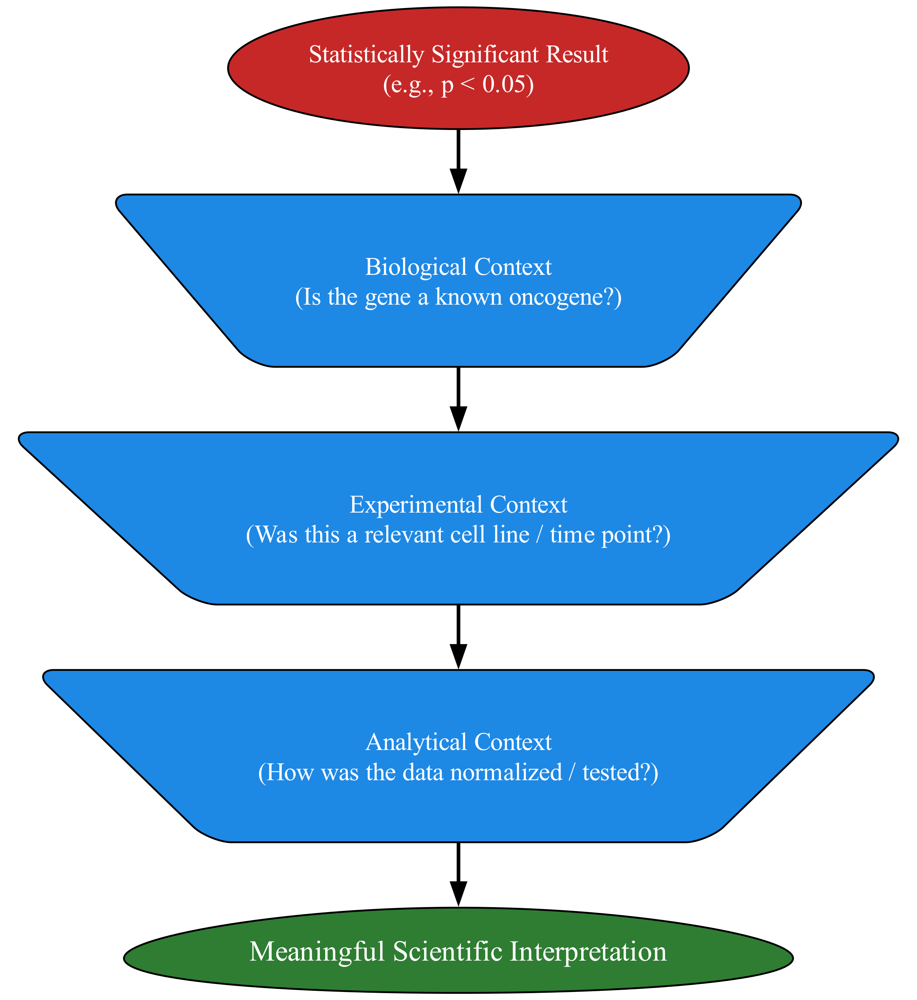
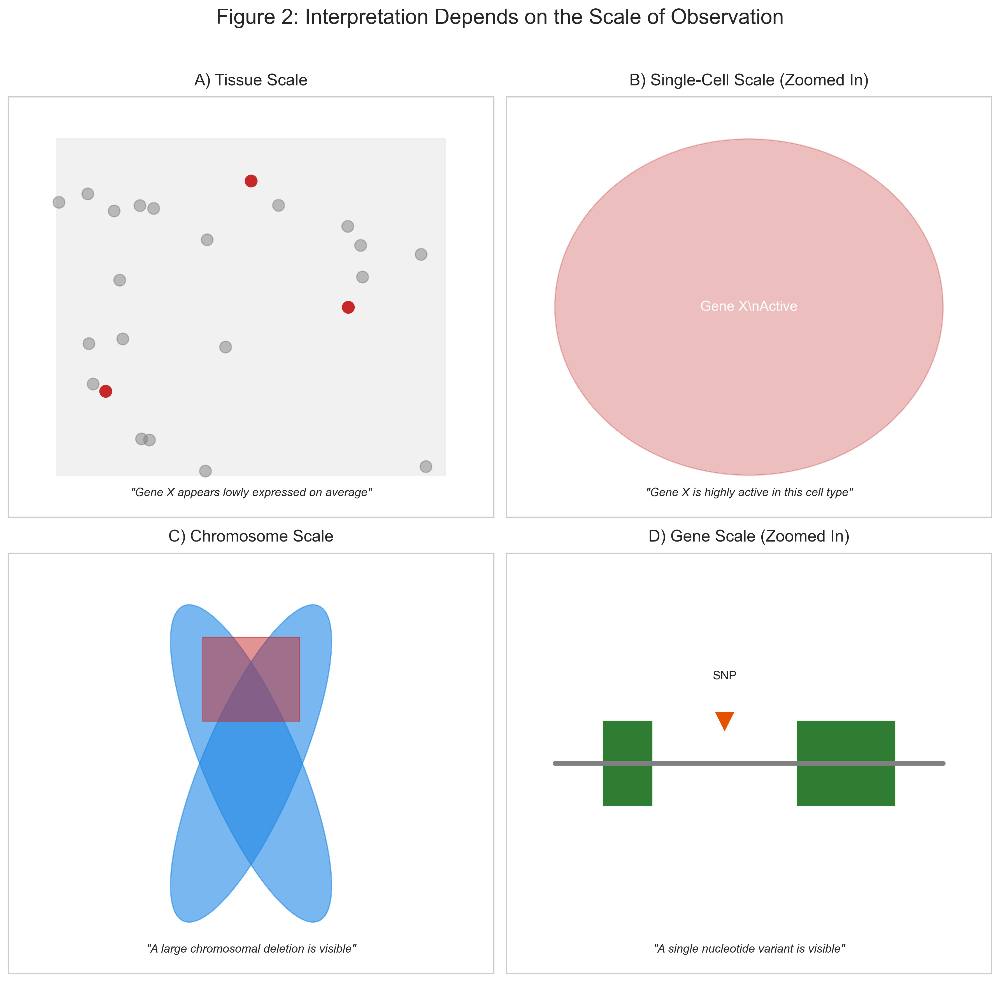
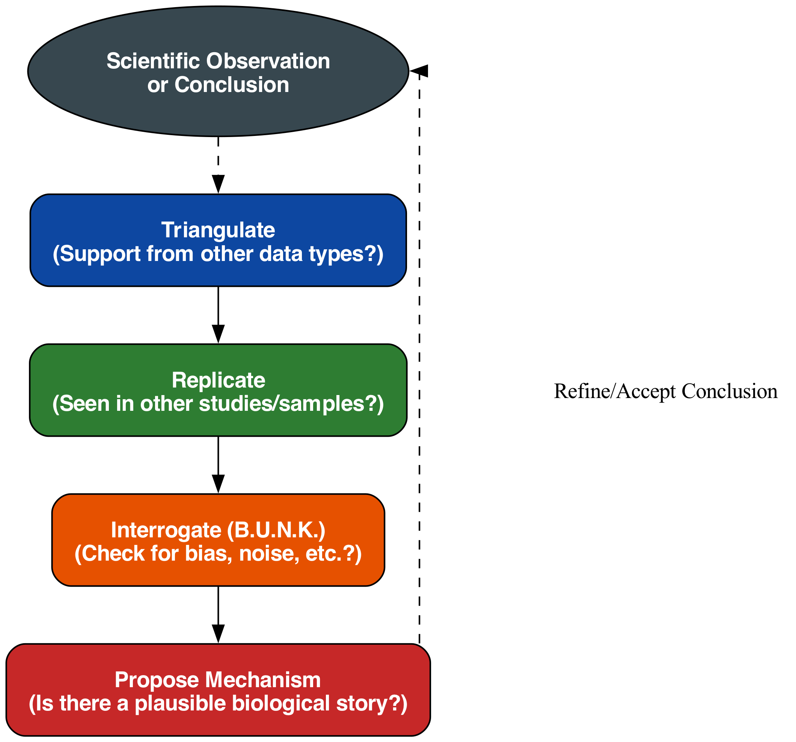

# Chapter 4: Context, Scale, and Interpretation

### The Final Lens

In the preceding chapters, we forged a set of intellectual lenses. We learned that data is a shadow of reality (Chapter 1), cast by a machine with distinct biological and technical parts (Chapter 2). We then learned to characterize the imperfections of this machine—its noise and biases—and to respond with a healthy, quantified skepticism we call uncertainty (Chapter 3). We have cultivated the discipline to pause, question, and check our results for artifacts using the B.U.N.K. framework.

We have learned *how to doubt*. Now, how do we learn *how to believe*?

A list of "significant" genes or a cluster of points on a plot is not, in itself, a discovery. It is an observation waiting for meaning. This final chapter of our foundational section is about the art and science of imbuing those observations with meaning. This is the act of interpretation, and it stands on three pillars: **Context**, **Scale**, and **Synthesis**.

### Part 1: Context – The "Where, When, and Why"

A single fact, devoid of context, is meaningless. The number `42` means nothing on its own. As an answer to "the ultimate question of life, the universe, and everything," it's a profound joke. As the age of a patient in a clinical trial, it's a crucial piece of metadata. Context is king.

-   **Biological Context:** A p-value of 1e-10 is statistically significant. But if you are studying lung cancer and the top hit is *EGFR*, a well-known oncogene whose mutation is a therapeutic target, your finding is immediately plausible and demands investigation. If the top hit is a gene that codes for an olfactory receptor, your result, while statistically strong, becomes biologically questionable. It requires a much higher burden of proof to be believed. Your interpretation is guided by decades of accumulated biological knowledge.
-   **Experimental Context:** Data from a time-course experiment, where you measure a system's response at 0, 5, 15, and 60 minutes, has a different interpretive frame than data from a case-control study comparing two static states. In the former, you look for trends, dynamics, and transient peaks. In the latter, you look for a persistent differential state. You must interpret your data within the logic of its experimental design.
-   **Analytical Context:** Your choice of software is a form of context. Using a lenient statistical test will produce more "significant" genes than a stringent one. Normalizing your data with one method versus another can subtly shift the results. There is no single "correct" pipeline; therefore, being transparent about the pipeline you used is essential context for others to interpret your results.

### Part 2: Scale – Choosing Your Magnifying Glass

The patterns you find in biological data are critically dependent on the scale at which you choose to look.
-   **Genomic Scale:** An analysis focused on single nucleotide polymorphisms (SNPs) is using a 1-base-pair magnifying glass. It is blind to a 10-million-base duplication (a copy number variation) that might be the true driver of disease. An analysis of chromosome structure will, in turn, miss the subtle effect of the SNP.
-   **Organismal Scale:** A classic example is averaging across a heterogeneous system. Imagine analyzing a brain tissue sample with bulk RNA-seq. You might conclude that "Gene X is lowly expressed in the brain." But if you zoom in with single-cell RNA-seq, you might find that Gene X is off in 99% of cells but is among the most highly-expressed genes in a tiny, crucial population of inhibitory neurons. The "average" at the tissue scale was mathematically correct but biologically misleading.
-   **Temporal Scale:** Measuring a cellular response seconds after a stimulus will reveal rapid, transient phosphorylation events in a signaling cascade. Measuring it hours later will reveal the downstream consequences: changes in the gene expression program. Measuring it weeks later might reveal permanent changes in cell fate. All are valid "responses," but they are different stories told at different time scales.

### Part 3: A Capstone Case Study – The "Significant" LncRNA

Let's walk through a realistic scenario to see how these frameworks merge into a single, coherent workflow.

**The Scenario:** A new PhD student, Alex, runs their first RNA-seq analysis. The experiment compares tumor samples to adjacent normal tissue. Alex discovers a previously uncharacterized long non-coding RNA, which we'll call *LNC-A*, that is strongly upregulated in tumors. The p-value is 1e-12. Alex is thrilled; this could be their thesis project.

**Step 1: Alex Applies the ORIGIN Framework (Chapter 1)**
Before celebrating, Alex questions the data's origin. Where did the samples come from? Who prepared them? How was the analysis done? In the metadata, Alex finds a potential problem: the tumor samples were, on average, from patients 15 years older than the patients who provided the normal tissue. Age is now a **confounding variable**. Is the upregulation of *LNC-A* due to cancer, or is it simply a gene associated with aging?

**Step 2: Alex Thinks Generatively (Chapter 2)**
Alex considers the process. *LNC-A* is unusually long (over 100,000 bases). Could this be a bias? Alex remembers the "gene length bias" from our generative model. The quantification method used was FPKM, which is known to be susceptible to this bias. This could be a technical artifact, not a biological signal.

**Step 3: Alex Deploys the B.U.N.K. Checklist (Chapter 3)**
-   **B (Bias):** Alex has two major red flags for bias: the age confounder and the potential for gene length bias. Alex also checks the batch information and finds the tumor and normal samples were sequenced six months apart. This is a massive **batch effect** red flag.
-   **U (Uncertainty):** The p-value (1e-12) is tiny, suggesting the result is not due to random chance. However, the effect size (fold change) is only 1.3x. This is a very small change in expression, making it more likely to be a subtle artifact of bias than a strong biological driver.
-   **N (Noise):** The expression of *LNC-A* is very low and highly variable across all samples. This means the signal-to-noise ratio is poor, making the measurement inherently less reliable.
-   **K (Kontext):** Alex performs a literature search. No other papers mention *LNC-A* in this cancer type or any related biological process. It has no known function.

**Step 4: Alex Performs the T.R.I.P. Check (Chapter 4)**
-   **T (Triangulate):** Alex looks at public datasets of histone modifications (ChIP-seq) for this cancer type. The genomic region for *LNC-A* shows no signs of active transcription (no promoter marks, no enhancer marks).
-   **R (Replicate):** Alex finds a larger, independent dataset from The Cancer Genome Atlas (TCGA). After carefully correcting for age and batch, the "significant" upregulation of *LNC-A* disappears entirely. It does not replicate.
-   **I (Interrogate):** Alex has thoroughly interrogated the result with B.U.N.K.
-   **P (Propose Mechanism):** Given the failure to replicate and the multiple red flags, it's impossible to propose a plausible biological mechanism.

**The Sobering Conclusion:** The "exciting discovery" was a phantom, an artifact created by a combination of age confounding, batch effects, and potential length bias. The tiny p-value was misleading. By applying the frameworks of Section I, Alex avoided spending years chasing a ghost and can now focus on re-analyzing the data correctly, controlling for the confounding variables.

### Part 4: Conclusion – Your Epistemological Toolbox

This chapter concludes the first and most important section of this book. We have not discussed a single advanced algorithm. We have not written a single line of production code. Instead, we have built something far more valuable: an epistemological toolbox for thinking about data.

Let's recap the journey:
1.  We began by accepting that **Data is a Shadow** (Chapter 1), a flawed projection of a complex reality. This led us to the **ORIGIN framework** to question the provenance of every dataset.
2.  We then modeled the machine that casts the shadow, understanding data as the output of a **Generative Process** involving both biology and measurement (Chapter 2).
3.  This led us to define the imperfections of this process—**Noise, Bias, and Uncertainty** (Chapter 3)—and to assemble the **B.U.N.K. checklist** to critically interrogate any surprising result.
4.  Finally, we synthesized these ideas into a workflow for interpretation, using **Context, Scale, and the T.R.I.P. Check** to build robust conclusions (Chapter 4).

You are now equipped with a powerful mental scaffolding. You know how to doubt your data, how to doubt your results, and how to build a case for believing in a finding. This discipline of thought is the bedrock upon which all meaningful bioinformatics analysis is built.

You are at the end of the beginning. In the sections that follow, we will finally turn to the data itself, starting with the alphabet of life: biological sequences.