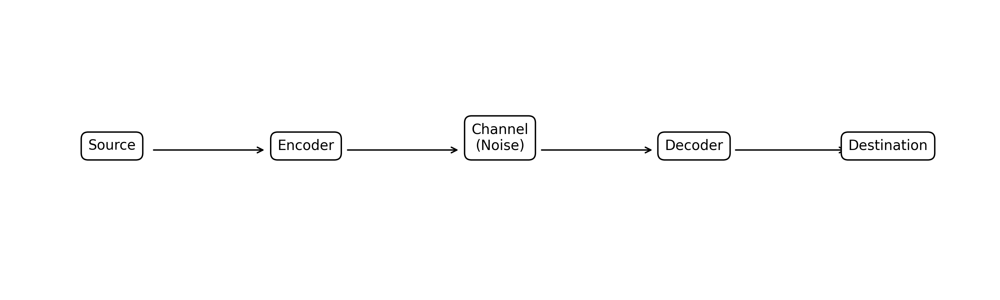
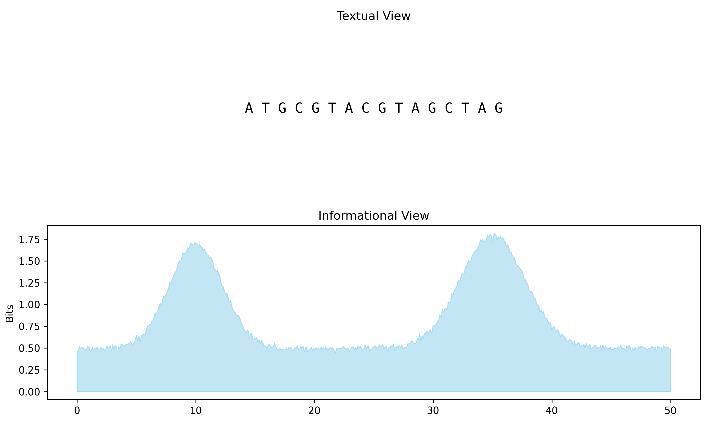
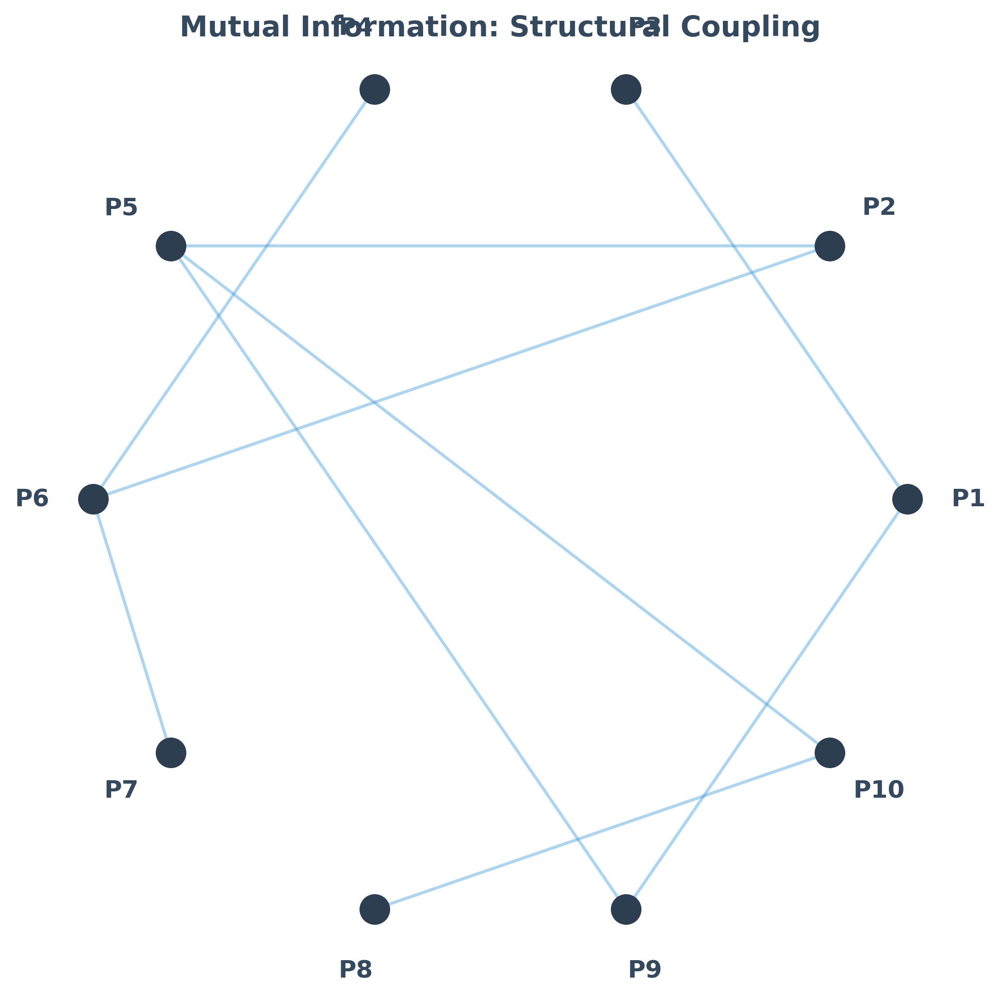
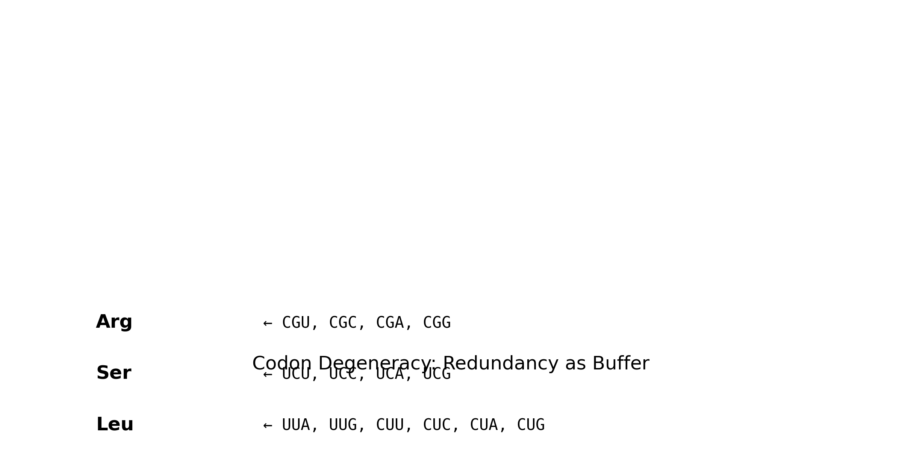

# Chapter 5: DNA as Information, Not Text

## The Textual Illusion: Breaking the Digital Habit
In the computational practice of bioinformatics, we are conditioned to treat DNA as a linear character string—a finite sequence of symbols from the alphabet $\Sigma = \{A, C, G, T\}$. This abstraction is a powerful tool for string matching, database indexing, and the execution of alignment algorithms. However, it creates a significant epistemic gap between our digital models and biological reality. The "String Fallacy" is the assumption that because we can represent DNA as text, it behaves like text.

In a biological system, there is no "string." There is only a polymer with specific physical properties. The information is not "in" the letters; it is encoded in the structural, energetic, and temporal states of the molecule. When we reduce DNA to text, we discard the very context that makes the information functional. This chapter reframes sequences as physical signals subject to the laws of information theory, thermodynamics, and evolutionary selection. To simplify bioinformatics, we must first unlearn the habit of seeing DNA as a word and begin seeing it as a spatial trajectory.

## The C.O.D.E. Framework: The Four Pillars of Sequence Information
To navigate the transition from "text" to "information," we use the **C.O.D.E.** framework. This helps us evaluate any sequence not by its characters, but by its informational properties.

*   **C — Constraint:** Not all sequences are possible. Evolutionary selection acts as a filter, "forbidding" certain states and "enforcing" others. A sequence is the record of what was allowed to survive. When we see a conserved motif, we are not seeing a "preferred word," but a physical requirement that survived a billion-year-old elimination tournament.
*   **O — Order as Energy:** The arrangement of nucleotides determines the thermodynamic stability of the molecule. Information is stored in the energy required to "unzip" or "fold" the sequence. A sequence is a potential energy landscape; the cell "reads" it by interacting with its peaks and valleys.
*   **D — Density:** Information is not distributed uniformly. Some regions are "dense" with functional meaning (high information content), while others are "sparse" (low information, neutral drift). Bioinformatics is the science of locating these high-density islands in a sea of stochastic noise.
*   **E — Entropy as a Measure:** We use Shannon Entropy to quantify how much "surprise" or "certainty" exists at a specific genomic position. It is our mathematical compass for identifying biological significance.

## The Alphabet as Geometry: Beyond A, T, G, and C
The symbols $A, C, G,$ and $T$ are convenience labels for complex nitrogenous bases. To the cell, these are not letters; they are chemical interfaces with distinct geometric and electronic signatures.

1.  **Purines vs. Pyrimidines:** $A$ and $G$ are large, two-ringed structures; $C$ and $T$ are smaller, single-ringed structures. A "match" in an alignment is actually a statement about the preservation of a specific geometric volume within the double helix.
2.  **Hydrogen Bonding Patterns:** $A$ pairs with $T$ via two hydrogen bonds; $G$ pairs with $C$ via three. The "information" here is the strength of the connection. A $G-C$ rich region is physically harder to open than an $A-T$ rich region, affecting transcription rates and melting points.
3.  **The Major and Minor Grooves:** The way these bases pair creates asymmetric "valleys" in the DNA helix. Binding proteins (the "readers" of the code) do not look at the letters; they feel the shape of these grooves using electrostatic and van der Waals forces. If a mutation changes the shape of the groove, the information is lost to the cell, even if the "letter" remains in our database.

## Shannon’s Bridge: The Communication Model of Biology
We can simplify the complexity of biology by mapping it onto Claude Shannon’s classic model of a communication system. This reframing allows us to apply the rigors of signal processing to biological data.

*   **The Source:** The evolutionary requirement (e.g., "Maintain a stable metabolic pathway").
*   **The Encoder:** Natural selection acting over millions of years, "writing" the optimized sequence into the genome.
*   **The Channel:** The intracellular environment, which is subject to radiation, chemical damage, and thermal noise.
*   **The Noise:** Stochastic mutations, replication errors, and horizontal gene transfer that degrade the original signal.
*   **The Decoder:** The transcriptional and translational machinery (ribosomes, polymerases) that "read" the physical state and produce a phenotype.
*   **The Destination:** The living organism that successfully carries out the function.

In this model, the task of bioinformatics is to **reverse-engineer the encoder**. We are trying to infer the original functional intent (the source) by observing a noisy, redundant output at the destination. We are not just matching strings; we are decoding a message transmitted across geological time.

## The P.L.O.T. Framework: Interpreting the Spatial Signal
When we analyze a sequence, we should "plot" its meaning using four spatial and temporal dimensions:

### 1. Physicality: The 3D Coordinate
A character string is one-dimensional and dimensionless. In contrast, DNA exists in three-dimensional space. The distance between two points in a sequence is usually measured in "base pairs" (bp), but for the biological machinery, the relevant distance is often a Euclidean measurement in Angstroms (Å). A sequence that is 1,000 bp away in 1D might be 5 Å away in 3D due to looping or folding. Bioinformatics is the art of predicting 3D proximity from 1D data.

### 2. Lineage: The Echo of Time
A biological sequence is a temporal artifact. It is the result of a lineage-specific path through the space of all possible sequences. Every mutation, deletion, and insertion is a step in a random walk that has been biased by selection. When we analyze a sequence, we are looking at a survivor. We must distinguish between "neutral drift" (noise) and "evolutionary signal" (information).

### 3. Optimization: The Search for Stability
Every sequence we observe has been optimized for a specific thermodynamic or functional goal. This optimization often leads to **Redundancy**. Shannon’s Second Theorem states that information can be transmitted reliably over a noisy channel if the message is sufficiently redundant. Biology uses codon degeneracy and gene duplication as "error-correction codes" to ensure the signal persists despite stochastic mutations. Redundancy is not waste; it is insurance.

### 4. Topology: The Context of Shape
The meaning of a sequence changes based on its topology. A linear piece of DNA behaves differently than a circular plasmid or a tightly wound supercoil. Topology is the "formatting" of the biological signal. Just as a word changes meaning based on its font or context, a sequence changes function based on its physical tension, twist, and accessibility.

## Quantifying Certainty: Shannon Entropy ($H$)
To move from qualitative description to quantitative analysis, we use Shannon Entropy. This is our primary tool for finding "meaning" in a sea of data. $H$ measures the uncertainty associated with a position in a sequence.

$$H = -\sum_{i \in \{A,C,G,T\}} p_i \log_2(p_i)$$

If a position is perfectly conserved (e.g., in a critical catalytic site), we have $p_i = 1$ for one base and $0$ for the others. This leads to $H = 0$. Zero uncertainty means maximum information. If all four bases are equally likely ($p_i = 0.25$), $H = 2$ bits. This position tells us nothing about the functional requirements of the site. High information content ($2 - H$) identifies the "peaks" of the biological signal.

## Mutual Information: How Positions "Talk"
Information is not just stored at individual sites; it is stored in the relationship between sites. This is known as **Mutual Information (MI)**. If two positions in a protein are physically in contact, a mutation in one often requires a compensatory mutation in the other to maintain the structural signal.

$$MI(X, Y) = \sum_{x \in X} \sum_{y \in Y} p(x, y) \log_2 \left( \frac{p(x, y)}{p(x)p(y)} \right)$$

By calculating MI, we can infer the 3D structure of molecules from 1D sequences. This proves that sequences are not just linear strings but networks of interdependent informational nodes. The "alphabet" of DNA is a system of coupled oscillators, not a list of characters.

## The Redundancy Paradox: Inefficiency as Robustness
Why does the genetic code use 64 codons for only 20 amino acids? To a computer scientist, this looks like an inefficient lookup table. To a bioinformatician, this is a **high-fidelity communication protocol**. By having multiple "names" for the same amino acid, biology creates a buffer. A single-point mutation often results in the same amino acid (a synonymous mutation), meaning the "functional signal" remains unchanged even if the "text" is altered. This is why we can find meaningful alignments between species that diverged hundreds of millions of years ago—the information is more stable than the letters.

## The Map vs. The Territory: Epistemic Discipline
A common mistake in bioinformatics is to confuse the "map" (the sequence in our database) with the "territory" (the physical DNA in the cell).
1.  **The Fallacy of the Index:** In a text file, index 100 is always 100 bytes from the start. In a genome, index 100 is a dynamic point on a flexible polymer. Inserting a single base changes the coordinates of everything downstream, but it may not change the "spatial" meaning of the sequence.
2.  **The Fallacy of the Reference:** A reference genome is a composite "average," not a biological truth. It is a coordinate system, not a molecule.
3.  **Context-Dependence:** The informational value of a sequence is not an intrinsic property of the DNA itself, but a property of the DNA-cell system. A transcription factor binding site (TFBS) only conveys information if the corresponding transcription factor is present.

## Thermodynamic Stability as a Filter
Information requires energy to maintain. The "melting" of DNA or the degradation of RNA is a process of information decay—a transition from a low-entropy (high-information) state to a high-entropy (random) state. Landauer's Principle suggests that erasing one bit of information releases a minimum amount of heat ($kT \ln 2$). Maintaining biological information requires a constant input of metabolic energy to repair DNA. When we analyze a sequence, we are looking at a signal that has been actively defended against the Second Law of Thermodynamics for eons.

## Summary: Thinking Spatially
By the end of this chapter, the mental model of the sequence must shift. A sequence like `ATGCGT...` is no longer a word. It is:
*   A **spatial trajectory** through the nucleus.
*   A **probabilistic distribution** of potential chemical states.
*   A **filtered signal** carrying the echoes of ancestral environments.
*   A **physical system** constrained by the same laws that govern stars and engines.

In the next chapter, we will apply this spatial and informational mindset to the problem of alignment. If we keep the C.O.D.E. and P.L.O.T. frameworks in mind, alignment becomes the comparison of two physical signals, and the scoring system becomes a set of assumptions about the noise in the biological channel.
