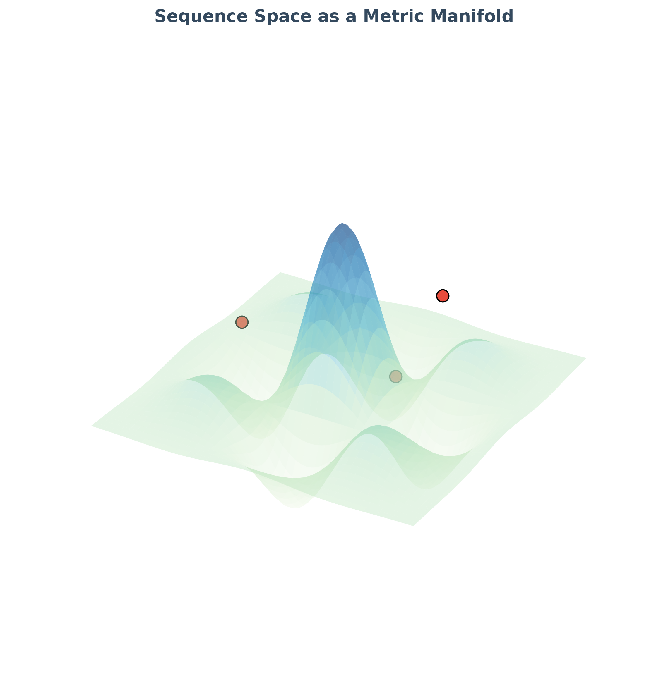
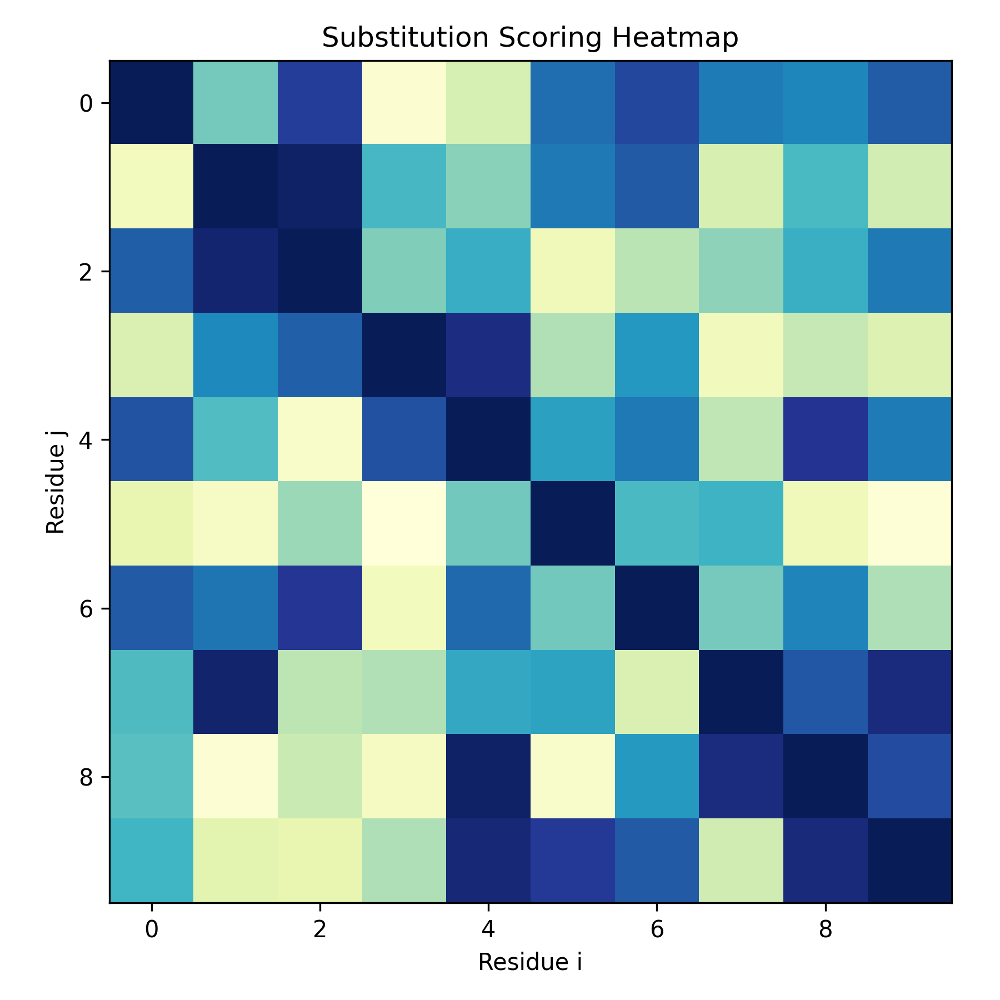
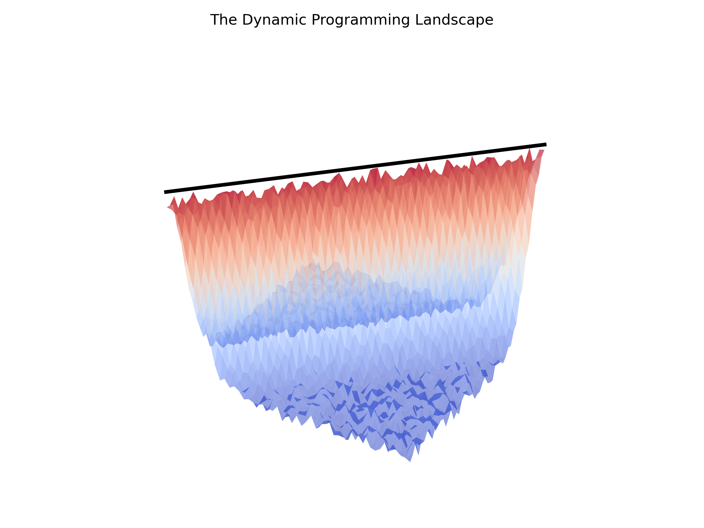
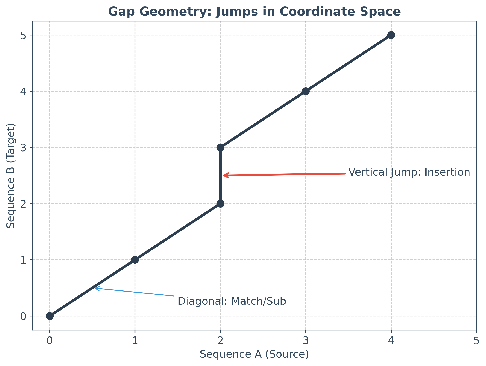
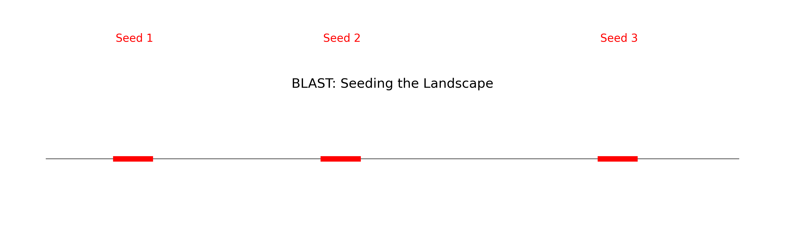

# Chapter 6: Alignment as Geometry

## The String Fallacy in Alignment: From Searching to Warping
In most computational fields, "searching" is a discrete operation: a pattern is either present or absent. In bioinformatics, the "String Fallacy" is the assumption that biological sequences can be compared using simple character-matching logic. Because biological information is a physical signal subject to millions of years of evolutionary noise, we rarely find exact matches. Instead, we perform **alignment**.

Alignment is the process of finding the optimal spatial and temporal relationship between two or more sequences. By the end of this chapter, the reader should stop seeing alignment as a character-matching exercise and begin seeing it as a **geometric optimization problem**: finding the path of least resistance through a high-dimensional scoring landscape. To align is to measure the "work" or "energy" required to transform one physical signal into another.

## The M.A.P.P.I.N.G. Framework
To simplify the geometric nature of alignment, we use the **M.A.P.P.I.N.G.** mnemonic. This framework ensures that alignment is treated as a physical transformation in coordinate space rather than a textual comparison.

*   **M — Matrix as a Landscape:** The scoring matrix is not a table of numbers, but a topographic map of potential biological relationships.
*   **A — Affine Costs:** The non-linear cost of gaps (opening vs. extending) reflects the physical difficulty of disrupting a molecule's continuity.
*   **P — Pathfinding:** Alignment is the search for a trajectory through a matrix that maximizes a cumulative "height" (score).
*   **P — Probabilistic Weights:** Substitution scores are log-odds ratios—mathematical statements about the likelihood of a shared ancestry.
*   **I — Interface Preservation:** We align to find which chemical interfaces have been preserved by selection.
*   **N — Neighbor Proximity:** Similarity is redefined as "distance" in a high-dimensional metric space.
*   **G — Geometric Constraint:** Global vs. Local alignment defines the physical boundaries of our search.

## Sequence Space as a Metric Manifold
To think geometrically, we must first define "distance." In a textual world, two characters are either the same or different. In a geometric world, we ask: *How much work is required to move from state A to state B?* This leads us to the concept of a **Metric Space**. A metric space is a set of points where a distance function $d(x, y)$ satisfies the triangle inequality: $d(x, z) \leq d(x, y) + d(y, z)$.

*Example: In music, distance is not about the specific notes, but the intervals between them. A melody transposed from C major to G major remains the "same" melody because the geometric relationships between the notes are preserved, even if every single "character" (the absolute pitch) has changed. Alignment is the search for these conserved intervals across different biological keys.*

### 1. Hamming Distance: The Rigid Metric
The Hamming distance ($d_H$) measures the number of positions where two sequences of equal length differ. This is the geometry of a "fixed" coordinate system where only the characters can change. It is the distance of a world without insertions or deletions.
$$d_H(s_1, s_2) = \sum_{i=1}^n [s_1[i] \neq s_2[i]]$$

### 2. Levenshtein (Edit) Distance: The Flexible Metric
Levenshtein distance ($d_L$) is the minimum number of "edit operations" (substitutions, insertions, deletions) required to transform one sequence into another. This metric allows the coordinate system to expand and contract. It treats each operation as a unit step in a high-dimensional manifold.

### 3. Biological Distance: The Weighted Manifold
In biology, not all steps are equal. Replacing an $A$ with a $G$ (a transition) is physically easier and more common than replacing $A$ with $C$ (a transversion). Biological distance is a "warped" metric where the weights are determined by chemical similarity and evolutionary probability.

## The Physics of Substitution: Matrices as Chemical Filters
When we align, we use a substitution matrix (like BLOSUM62 or PAM250). These are not arbitrary datasets; they are models of the "geometric cost" of chemical exchange.

1.  **PAM (Point Accepted Mutation):** PAM matrices are models of **evolutionary time**. A PAM1 matrix represents the probability of change over a period where 1% of positions change. Multiplying this matrix by itself ($PAM1^n$) simulates the "diffusion" of a sequence through space over long timescales.
2.  **BLOSUM (Blocks Substitution Matrix):** BLOSUM matrices are models of **functional constraint**. They are derived from "blocks" of conserved sequences. BLOSUM62, for example, is derived from sequences clustered at 62% identity. It measures what physical interfaces are "allowed" to persist in a functional protein.

*Example: In a protein, a Leucine ($L$) and an Isoleucine ($I$) are different letters, but they are nearly identical in volume and hydrophobicity. Replacing one with the other is like changing a single word in a poem with a synonym—the meter and meaning (the structure) remain intact. A substitution matrix is a dictionary of these biological synonyms.*

A score in these matrices is a log-odds ratio:
$$S_{ij} = \frac{1}{\lambda} \log \left( \frac{q_{ij}}{p_i p_j} \right)$$
Where $q_{ij}$ is the observed frequency of substitution $i \to j$, and $p_i, p_j$ are background frequencies. A positive score means the substitution is more likely than random chance, indicating a shared physical constraint.

## The Scoring Manifold: Dynamic Programming in 3D
The core of sequence alignment is Dynamic Programming (DP), specifically the Needleman-Wunsch and Smith-Waterman algorithms. In a geometric mindset, DP is the construction of a **Scoring Manifold**.

*Example: Imagine hiking through a mountain range to reach a specific destination. You could walk in a straight line, but the "cost" (energy) would be too high if it requires scaling a vertical cliff. Instead, you follow the trails—the paths of least resistance that have already been laid out by the topography. Alignment is the process of finding these "evolutionary trails" through the scoring landscape.*

Imagine a 2D grid where Sequence A is on the X-axis and Sequence B is on the Y-axis. Every cell $(i, j)$ represents a potential pairing. We can add a Z-axis representing the cumulative score. This creates a surface with peaks, valleys, and ridges.
*   **The Initialization:** We set the starting boundary conditions (the "floor" of our landscape).
*   **The Recurrence:** For every cell, we look at three neighbors (diagonal, up, left) and choose the one that provides the maximum "altitude." This is Bellman's Principle of Optimality.
*   **The Path:** The final alignment is the "ridge" that follows the highest possible cumulative score through the matrix.

## The W.A.R.P. Mnemonic: Why We Need Gaps
Biological signals do not just change characters; they expand and contract. To align them, we must "warp" the coordinate system. We use the **W.A.R.P.** mnemonic to understand this process:

*   **W — Weighting of the Jump:** Gaps are expensive because they disrupt the physical continuity of the molecule.
*   **A — Anchor Points:** Conserved regions act as geometric anchors that hold the alignment in place.
*   **R — Rotation/Rearrangement:** In complex alignments (like inversions), the sequence might "rotate" in coordinate space.
*   **P — Persistence:** A gap, once opened, tends to persist. We model this using **Affine Gap Penalties**.

$$Score_{gap} = \gamma + \delta \cdot (L-1)$$
$\gamma$ (Gap Open) is the high energetic cost of breaking the helix or protein backbone. $\delta$ (Gap Extend) is the lower cost of increasing the size of that break. This mathematical model reflects a physical reality: it is harder to start a mutation than to continue one.

## Heuristics: Scanning the Landscape (BLAST)
For massive datasets, mapping the entire DP manifold is computationally impossible ($O(n^2)$). Tools like BLAST (Basic Local Alignment Search Tool) use a **Heuristic Approximation**.

1.  **Seeding:** Instead of mapping everything, BLAST looks for tiny "perfect matches" (seeds). These are the "mountain peaks" that are visible from a distance.
2.  **Extension:** From these peaks, the algorithm "walks" down the slope until the score drops too low.
3.  **High-Scoring Pairs (HSPs):** Only the most significant peaks are reported.

BLAST is essentially a low-resolution satellite scan of the sequence space. It might miss some small valleys, but it is guaranteed to find the major landmarks.

## Global vs. Local: The Scale of Observation
The choice of alignment algorithm defines the **Scale of the Geometry**:
*   **Global (Needleman-Wunsch):** We assume the two signals are homologous from end to end. We force the path to go from $(0,0)$ to $(n,m)$. This is a search for a total structural mapping.
*   **Local (Smith-Waterman):** We assume the signals are buried in noise. We allow the path to start and end anywhere. This is a search for conserved "islands" in a sea of divergent "water."

## Alignment as Coordinate Transformation
To simplify bioinformatics, we can view alignment as a mapping between two coordinate systems. If Sequence A has an insertion relative to Sequence B, it has "dilated" its coordinate space. Alignment is the set of operations (the transformation matrix) required to bring these two disparate spaces into a unified reference frame. We are "warping" one signal to fit the other, and the "energy" required for this warp is our final score.

## Conclusion: Similarity as Proximity
By the end of this chapter, "similarity" should be synonymous with "proximity in sequence space." To align is to measure how much work is required to transform one physical signal into another. If the work required is low, the sequences are "close" and likely share a common biological intent.

In the next chapter, we will see how these pairwise "paths" are stitched together in the process of assembly. If alignment is about finding a path between two signals, assembly is about reconstructing the entire map of a genome from thousands of fragmented echoes.
