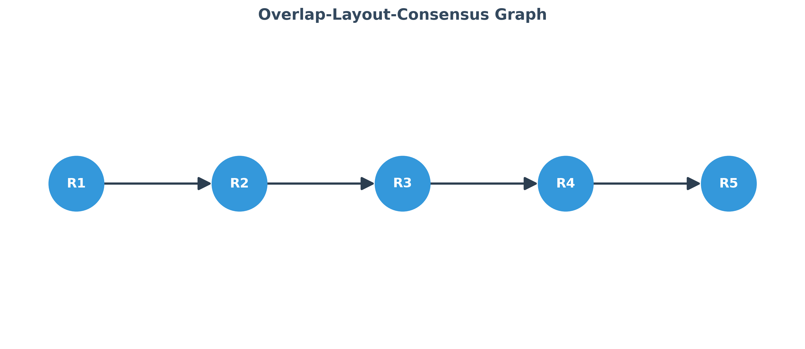
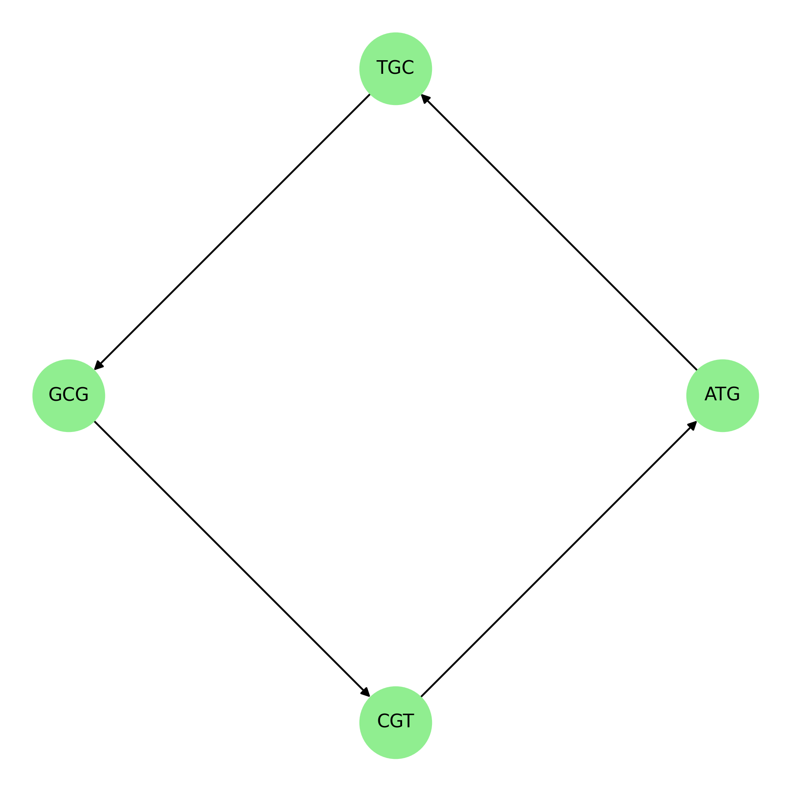
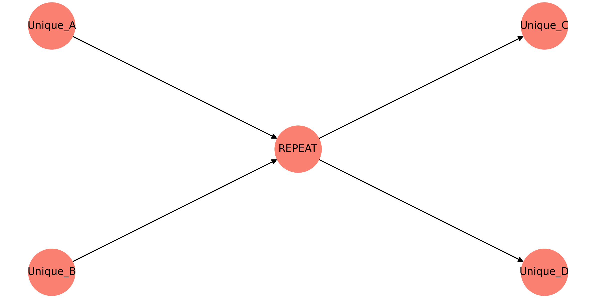

# Chapter 7: Assembly as Graph Construction

## The Fragment Paradox: Reconstructing a Shattered Signal
In the previous chapters, we treated biological sequences as either physical signals (Chapter 5) or trajectories in a scoring landscape (Chapter 6). However, the technological reality of DNA sequencing presents a fundamental paradox: we want to understand an entire genome, but we can only measure tiny, disconnected fragments (reads). 

The "Fragment Paradox" is the challenge of reconstructing a global structural map from local, noisy echoes. If we think of a genome as a book, sequencing doesn't give us the book; it gives us millions of shredded, overlapping scraps. The task of assembly is not to "glue" these scraps together, but to reconstruct the underlying **topology** of the information. By the end of this chapter, the reader should see a genome not as a long string, but as a path through a complex graph.

## The S.H.R.E.D. Framework: Understanding the Inputs
To simplify the challenges of assembly, we use the **S.H.R.E.D.** mnemonic. This framework helps us evaluate the quality and complexity of the raw data before we attempt to build a map.

*   **S — Sampling Bias:** Not all regions of a genome are sequenced with equal probability. Some areas (like high GC-content regions) are often "under-sampled," creating holes in our spatial map.
*   **H — Heterogeneity:** Biological samples are rarely pure. We often sequence a mixture of different cells, leading to "noise" in the assembly graph where different versions of a sequence compete for the same space.
*   **R — Repetitive Regions:** Genomes are full of repeats. These are the "tangles" in the graph that make it impossible to determine a single linear path. Repetition is the primary enemy of structural certainty.
*   **E — Error Profiles:** Every sequencing technology has a "fingerprint" of errors (e.g., substitution errors in Illumina vs. indels in Oxford Nanopore). We must treat every read as a probabilistic signal, not a literal truth.
*   **D — Decomposition:** We must break reads down into even smaller units (k-mers) to find the overlaps that reveal the connections between fragments.

## From Overlaps to Graphs: Two Modes of Assembly
There are two primary geometric strategies for assembly. Choosing between them is a choice between focusing on the **reads** or focusing on the **information**.

### 1. Overlap-Layout-Consensus (OLC)
In the OLC approach, we treat every read as a node in a graph. We draw an edge between two nodes if the reads overlap significantly (as determined by the alignment principles in Chapter 6). 
*   **Overlap:** Perform all-vs-all alignment.
*   **Layout:** Simplify the resulting "hairball" graph to find a path.
*   **Consensus:** Determine the most likely sequence along that path.
OLC is spatially intuitive but computationally expensive ($O(n^2)$), making it difficult to use for massive datasets.

### 2. De Bruijn Graphs (dBG)
The de Bruijn strategy shifts the focus from the reads to the **k-mers** (substrings of length $k$). We decompose every read into all possible k-mers.
*   **Nodes:** Every unique k-mer in the dataset becomes a node.
*   **Edges:** An edge exists if two k-mers overlap by $k-1$ characters.
The geometry of a dBG is determined by the **k-mer spectrum** of the genome. In this view, a read is just a "walk" through a pre-existing graph of all possible information. dBG is much faster for large datasets but is highly sensitive to sequencing errors and repetitive "cycles."

## The G.R.A.P.H. Mnemonic: The Logic of Assembly
Once we have a graph, we must navigate it to reconstruct the sequence. We use the **G.R.A.P.H.** mnemonic to guide this navigation:

*   **G — Goal (The Eulerian/Hamiltonian Path):** We are looking for a path that visits every node or edge exactly once. This is the mathematical "reconstruction" of the biological signal.
*   **R — Resolution of Ambiguity:** When the graph forks (a "bubble"), we must use auxiliary data (like long-range connectivity) to decide which path is real.
*   **A — Assembly Graphs as Topology:** A genome is not a string; it is a topological object. Dead ends are missing data; cycles are repeats; bubbles are variation.
*   **P — Pruning the Noise:** We must remove "tips" (short dead-end branches) and "bubbles" (minor variations) that are likely caused by sequencing errors.
*   **H — Hubs and Repeats:** High-degree nodes (hubs) are the repeat regions where the graph becomes a "knot" that cannot be untangled without more information.

## The Repeat Problem: Why "Complete" is a Misnomer
The most significant barrier to a perfect assembly is **Repetitive Information**. If a sequence (e.g., a transposon) appears twice in the genome, it will collapse into a single node in a de Bruijn graph or a single hub in an overlap graph.

Imagine trying to map a city where every street corner looks identical. You cannot tell if you are at the first corner or the tenth. This is the "ambiguity" of the assembly graph. To resolve it, we need reads that are **longer than the repeat**. If we cannot "bridge" the repeat, the assembly remains fragmented into disconnected "contigs" (contiguous sequences). This is why a "finished genome" is often just a collection of very long fragments rather than a single uninterrupted string.

## Scaffolding: Connecting the Islands
When the graph cannot be resolved into a single path, we use **Scaffolding**. This is the process of using "linkage" information (e.g., paired-end reads or Hi-C data) to determine the relative order and orientation of contigs, even if we don't know the exact sequence of the "gaps" between them. Scaffolding is like placing islands on a map—we know the distance between the islands, even if we haven't mapped the seafloor between them.

## The Epistemology of the Contig
A "contig" is a statement of certainty. It represents a path in the assembly graph that is unambiguous. Every time an assembly breaks, it is because the "informational geometry" of the genome was too complex for the "spatial resolution" of our sequencing reads. Therefore, a bioinformatician must treat an assembly not as a final truth, but as a **structural hypothesis**.

We must distinguish between:
1.  **The Biological Genome:** The actual physical molecule.
2.  **The Assembly Graph:** The mathematical representation of our fragmented measurements.
3.  **The Contig Set:** The linear segments we extract from the graph.

## Graph Simplification: Removing the Noise
The raw assembly graph is usually unreadable due to errors. Assembly algorithms perform several geometric simplifications:
*   **Tip Removal:** Deleting short paths that end abruptly (usually caused by a single error at the end of a read).
*   **Bubble Collapsing:** Merging two paths that start and end at the same nodes (usually caused by heterozygosity or single-point errors).
*   **Unitig Construction:** Identifying paths where every node has exactly one incoming and one outgoing edge. These are the "unambiguous" building blocks of the assembly.

## Conclusion: Reconstructing Structure from Chaos
By the end of this chapter, the reader should see assembly as a **topological reconstruction**. We are not "building a string"; we are "recovering a graph." The gaps in our assembly are not just missing data—they are the limits of our geometric resolution. 

In the final chapter of this section, we will see how the small variations in these graphs and alignments are not "errors," but the very biological signals that define individuality and evolution. If assembly is about building the map, variation is about understanding the meaningful deviations from that map.
