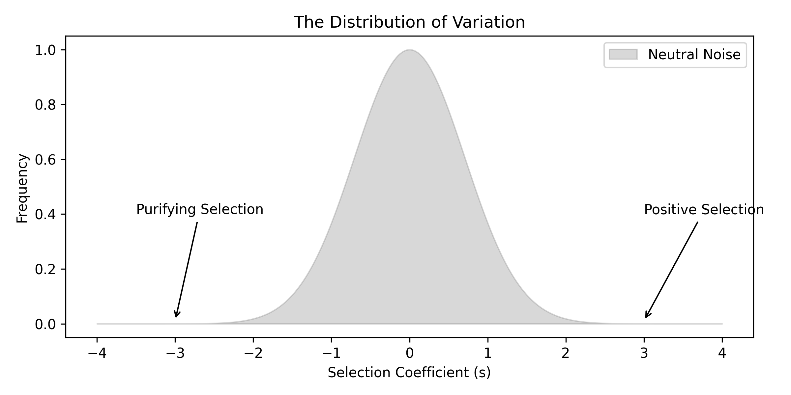
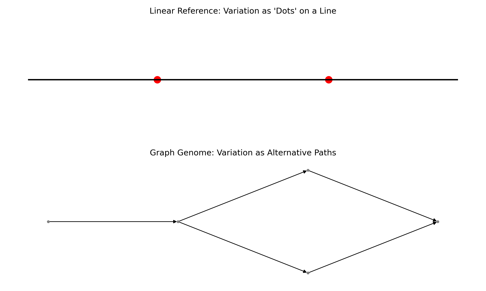
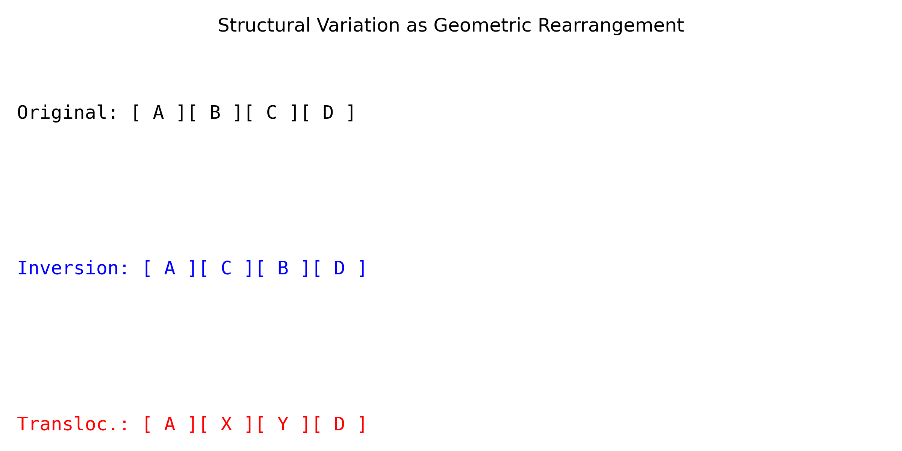

# Chapter 8: Variation as Biological Signal

## Variation is not Error: Redefining the Null Expectation
In the final chapter of this section, we address a fundamental linguistic and conceptual trap in bioinformatics: the tendency to refer to sequence differences as "mutations," "errors," or "variants." These terms imply a "correct" version of the genome and a set of "incorrect" deviations. This "Standard Reference Fallacy" is a remnant of the textual view of DNA.

In a biological reality, there is no "correct" sequence. There is only a distribution of informational states within a population. Variation is the very substance of biology—it is the raw material of evolution and the primary signal that allows us to distinguish between individuals, populations, and species. By the end of this chapter, the reader should see variation not as a deviation from a map, but as the **resolution** of the biological signal. To understand variation is to understand the boundaries of what is physically and evolutionarily possible. *A variant is not a flaw in the text, but a shimmer in the biological lens.*

## The V.A.R.I.A.N.T. Framework: Categorizing the Signal
To simplify the types of variation we observe in coordinate space, we use the **V.A.R.I.A.N.T.** mnemonic. This framework shifts our focus from the "characters" to the "spatial properties" of the change.

*   **V — Volume Changes:** Insertions and deletions (indels) that change the physical length of the signal. These are coordinate-shifting events.
*   **A — Allelic Frequency:** The probability of observing a specific state within a population. Rare alleles often represent recent signals or high-impact perturbations.
*   **R — Reference Bias:** The geometric distortion created by comparing all signals to a single, arbitrary "standard" map.
*   **I — Impact vs. Effect:** Distinguishing between a physical change (impact on the molecule) and its biological consequence (effect on the organism).
*   **A — Ancestral State:** Determining which version of the signal is the "original" and which is the "derived" helps us map the direction of information flow over time.
*   **N — Non-Coding Signal:** Recognizing that variation in the "dark matter" of the genome is often a regulatory signal that changes the "volume" or "timing" of other signals.
*   **T — Transition/Transversion Ratio ($Ti/Tv$):** The physical bias in how nucleotides swap positions. $A \leftrightarrow G$ (transitions) are chemically more similar and thus more frequent than transversions ($A \leftrightarrow C$). A deviation in this ratio is a signal of unusual selective pressure.

## The Null Expectation: What is "Normal" Variation?
To identify a meaningful signal, we must first understand the "noise." In population genetics, we use the **Neutral Theory** as our null hypothesis. Most variation has no physical effect on the organism; it is simply the result of stochastic drift—the "random walk" of information through time.

*Example: In language, an accent is a neutral variation. If one speaker pronounces "data" differently than another, the meaning (the biological signal) remains unchanged. However, if a speaker changes a single letter that transforms "data" into "date," the meaning has shifted. In bioinformatics, we must distinguish between the "accent" of a population and the "vocabulary change" of a mutation. *The neutral variant is the melody of drift; the selected variant is the harmony of survival.***

We quantify the "amount" of variation using metrics like **Nucleotide Diversity ($\pi$)**:
$$\pi = \sum_{ij} x_i x_j \pi_{ij}$$
Where $x_i$ and $x_j$ are the frequencies of the $i$-th and $j$-th sequences, and $\pi_{ij}$ is the number of differences between them. A high $\pi$ suggests a diverse, robust information pool that has been defended against bottlenecks. A low $\pi$ suggests a recent selective sweep where one "peak" in the information landscape has dominated all others.

## The S.I.G.N.I.F.I.C.A.N.C.E. Mnemonic: Evaluating Impact
When we find a variant, we must determine if it is a "functional signal" or "neutral noise." We use the **S.I.G.N.I.F.I.C.A.N.C.E.** framework:

*   **S — Substitution Type:** Synonymous (no change in amino acid) vs. Non-synonymous (missense or nonsense).
*   **I — In-frame vs. Frameshift:** Does an indel preserve the "reading rhythm" of the ribosome? A single base shift can "scramble" the entire downstream signal.
*   **G — Genomic Context:** Is the variant in a peak of high information density (e.g., a conserved catalytic site) or a valley (e.g., an intergenic region)?
*   **N — Neighborhood Effects:** How does the variant affect the 3D folding of the surrounding molecule? A distant mutation might close a binding pocket.
*   **I — Interaction Network:** Does the change disrupt a docking site for a protein partner? We must view the variant as part of a system.
*   **F — Frequency in Population:** Rare variants are statistically more likely to have high functional impact because damaging signals are quickly removed by selection.
*   **I — Inheritance Pattern:** Is the signal dominant (overrides other signals), recessive (hidden), or additive?
*   **C — Conservation Score:** Using phylogenetic history (deep time) to predict if a site can tolerate change.
*   **A — Amino Acid Properties:** Did we swap a small hydrophobic residue (Leucine) for a massive charged one (Arginine)? This is a major geometric perturbation.
*   **N — Non-canonical Effects:** Splicing disruptions, miRNA binding site changes, or enhancer silencing.
*   **C — Clinvar/Database Evidence:** Checking if the signal has been characterized in other biological contexts.
*   **E — Epigenetic State:** Is the variant in a region of "silent" chromatin where the signal is physically inaccessible?

## The P.A.N.G.E.N.O.M.E. Framework: Transitioning to Graphs
The "Reference Genome" is a coordinate trap. By forcing every individual's signal onto a single linear map, we become "blind" to any information that the reference does not possess. To simplify this, we must move toward the **P.A.N.G.E.N.O.M.E.** mindset:

*   **P — Population-level backbone:** The genome is the union of all sequences in a species, not one individual.
*   **A — Alternative Paths:** Variation appears as "bubbles" or "divergences" in a graph.
*   **N — Non-linear Coordinates:** We must use graph coordinates ($Node, Offset$) instead of linear ones ($Chr, Pos$).
*   **G — Geometric Inclusion:** Structural variants (inversions, large insertions) are naturally represented as edges in the graph.
*   **E — Evolutionary Branching:** The graph captures the phylogenetic relationships between different versions of the signal.
*   **N — Network of Haplotypes:** Individuals are "walks" through the species-wide graph.
*   **O — Optimized Search:** Graph-based alignment is more accurate because it accounts for known variation.
*   **M — Mapping Certainty:** We can quantify how well a new read fits the existing graph topology.
*   **E — Epistemic Humility:** Recognizing that our "reference" is just one possible path through a much larger informational space. *The reference is a single ray of light; the pangenome is the sun itself.*

## The Scales of Change: From Pixels to Architecture
We categorize variation by its geometric scale, moving from local "typos" to global "remodellings":

1.  **Single Nucleotide Polymorphisms (SNPs):** These are the "pixels" of variation. While small, a single SNP in a high-density information peak (like the sickle cell mutation in Hemoglobin) can collapse the entire biological system.
2.  **Small Indels:** These expand or contract the coordinate system. They are often found in repetitive "valley" regions where the biological signal is less constrained.
3.  **Structural Variants (SVs):** Large-scale rearrangements ($>50$ bp) that change the architecture of the genome.
    *   **Inversions:** The signal is physically flipped. The "text" is the same, but the "orientation" relative to other regulatory signals is reversed.
    *   **Translocations:** A piece of the signal is moved to a completely different coordinate. This can place a gene under the control of an entirely different "volume knob" (promoter).
    *   **Copy Number Variation (CNVs):** The "volume" of the signal is increased or decreased. Having three copies of a gene instead of two can lead to toxic levels of information output.

## Epistatic Geometry: The Interaction of Signals
In a textual view, a variant at position 100 is independent of a variant at position 200. In a spatial view, these sites might be physically touching in the folded protein. **Epistasis** is the phenomenon where the effect of one variant depends on the presence of another. 

Imagine a key and a lock. If the key changes shape (Variant A), it might stop working. But if the lock also changes shape in a complementary way (Variant B), the function is restored. Individually, A and B are "damaging"; together, they are "neutral." This geometric coupling proves that we cannot analyze variants in isolation—we must view them as interdependent nodes in a physical network.

*Example: In music, a single note is not a chord. If you change a C to a C#, the emotional "signal" of the music shifts from stable to dissonant. But if you also change the supporting E to an F, you might resolve the dissonance into a new harmony. The "meaning" of the first change was entirely dependent on the context of the second. *In the cell, no variant sings alone.***

## The Information Channel: Signal-to-Noise Ratio ($S/N$)
We can apply signal processing logic to variation.
*   **Signal:** Variants that have been preserved or selected because they convey a functional advantage.
*   **Noise:** Variants that are the result of stochastic errors and haven't been removed yet.
*   **Filter:** Natural selection acting as a "low-pass filter," removing high-frequency damaging variants and allowing low-frequency beneficial or neutral variants to pass through the generations.

*Example: A variant is not an answer; it is a hypothesis. When we observe a difference in a patient's genome, we are looking at a signal that could mean "disease," "ancestry," or "nothing." The goal of bioinformatics is not to find the variant, but to test the hypothesis of its significance against the background noise of millions of other differences.*

In this view, the task of the bioinformatician is to **increase the S/N ratio**. By using evolutionary conservation scores and chemical property models, we "filter" the millions of observed variants to find the few that actually drive the biological phenotype.

## Conclusion: Variation as the Resolution of Life
Section II has moved us from the illusion of "DNA as text" to the reality of **DNA as spatial information**. We have seen how:
1.  Information is physical, thermodynamic, and constrained (Chapter 5).
2.  Similarity is a distance in a warped metric manifold (Chapter 6).
3.  Structure is a topological graph reconstructed from fragmented echoes (Chapter 7).
4.  Variation is the high-resolution signal of individuality and evolutionary survival (Chapter 8).

When we analyze a genome, we are not just running a tool. We are navigating a high-dimensional, temporal, and spatial map of life's survivors. The "simplicity" of bioinformatics lies in recognizing these universal geometric and informational principles beneath the overwhelming complexity of the data. We no longer ask "what is the letter?"; we ask "what is the signal?" *We are the cartographers of a territory that is always in motion.*

## Section II Closure Summary
This section has successfully reframed biological sequences. The reader should now be able to visualize a genome as a dynamic, topological graph rather than a static string. We have replaced "matching" with "warping," "assembly" with "pathfinding," and "error" with "signal." With this informational foundation, we have completed the shift from Section I's epistemological discipline to Section II's spatial intuition. We are now prepared for Section III, where we will explore how these spatial signals are activated, regulated, and transformed into the dynamic complexity of the living cell.